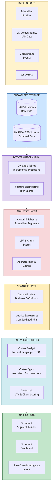
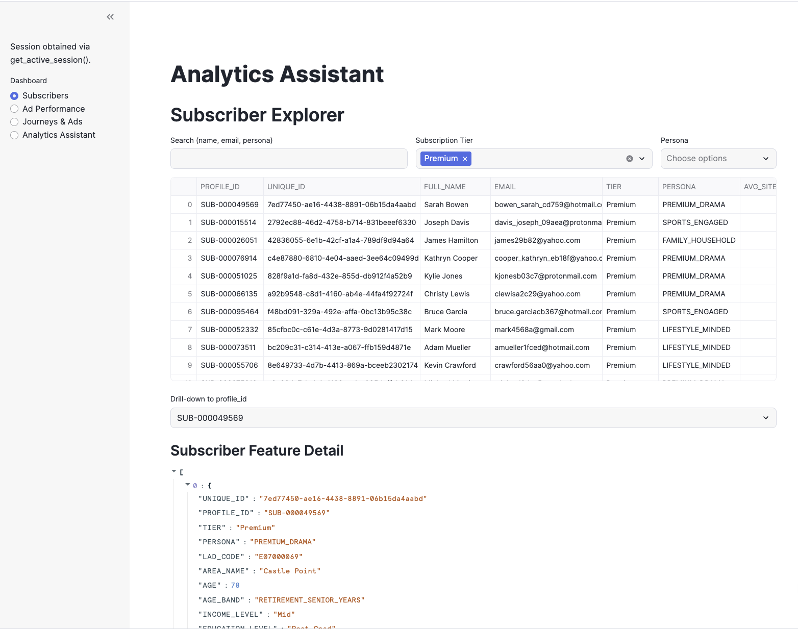
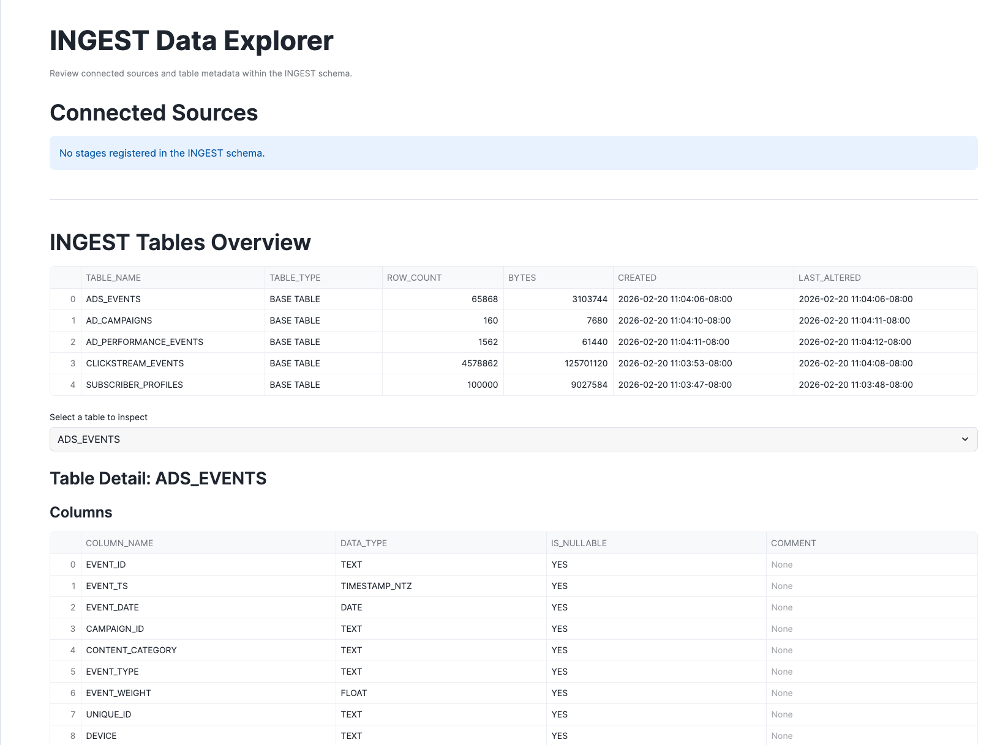
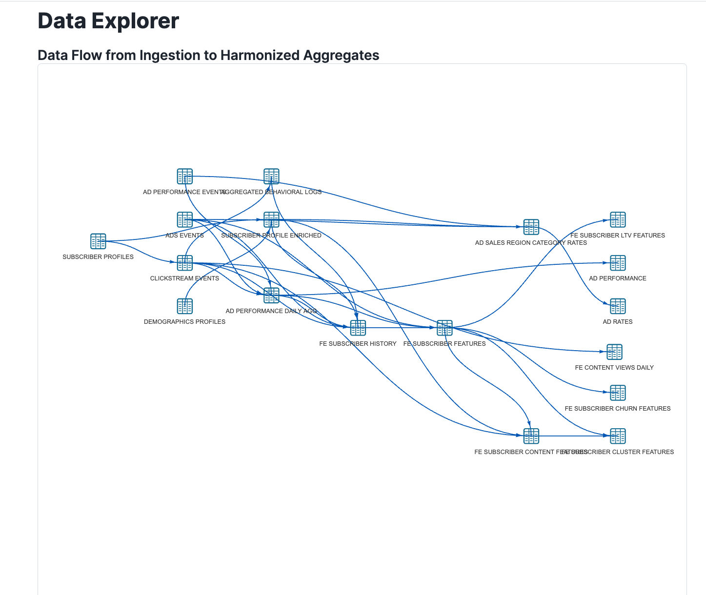
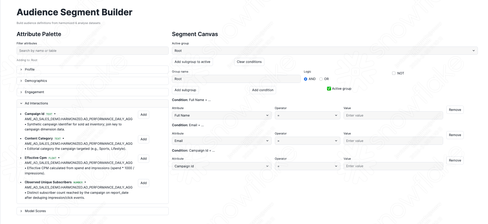
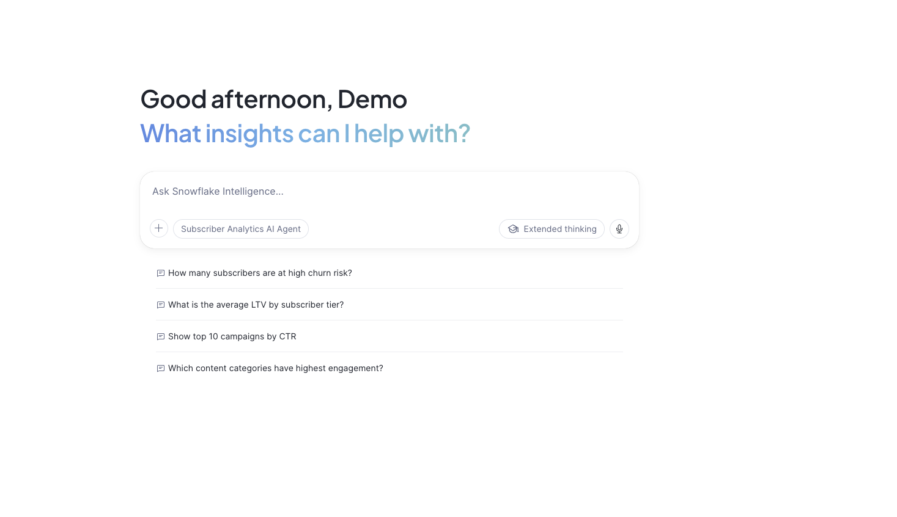

author: Fredrik Goransson, Joviane Bellegarde
id: agentic-audience-analytics
summary: Build an end-to-end Media & Entertainment subscriber analytics solution with audience segmentation, ML scoring, and Snowflake Intelligence for natural language queries
categories: snowflake-site:taxonomy/solution-center/certification/quickstart, snowflake-site:taxonomy/solution-center/certification/certified-solution, snowflake-site:taxonomy/industry/media-and-entertainment, snowflake-site:taxonomy/product/ai, snowflake-site:taxonomy/snowflake-feature/streamlit-in-snowflake, snowflake-site:taxonomy/snowflake-feature/cortex-ai
environments: web
language: en
status: Published
feedback link: https://github.com/Snowflake-Labs/sfguides/issues
tags: Getting Started, Media, Entertainment, Advertising, Streamlit, Snowflake Intelligence, Cortex, Semantic View, Audience Segmentation, LTV, Churn
fork repo link: https://github.com/Snowflake-Labs/sfguide-mea-subscriber-analytics

# Agentic Audience Analytics for Media & Entertainment

## Overview

Media & Entertainment companies need to understand their subscribers deeply to deliver personalized content, optimize ad campaigns, and reduce churn. This guide demonstrates how to build a comprehensive subscriber analytics solution using **Snowflake Intelligence** and **Streamlit in Snowflake**.

In this Guide, you will build a complete audience analytics platform that:
- Generates synthetic subscriber data with realistic demographics and behaviors
- Creates data transformation layers (Generate → Ingest → Harmonize → Analyze)
- Builds ML features for churn risk and lifetime value scoring
- Enables natural language queries via Snowflake Intelligence

### What You Will Build
- Synthetic data generation pipeline for 100K+ subscribers
- Multi-schema data architecture with governed data marts
- Four Streamlit applications for data exploration and audience segmentation
- Snowflake Intelligence Agent for natural language analytics
- Semantic View for structured data access

### What You Will Learn
- How to deploy Streamlit applications in Snowflake
- How to create Semantic Views for natural language queries
- How to configure Snowflake Intelligence Agents
- How to build audience segments with ML scoring
- How to implement a medallion architecture in Snowflake

### Prerequisites
- A Snowflake account with ACCOUNTADMIN privileges
- Go to the <a href="https://signup.snowflake.com/?utm_source=snowflake-devrel&utm_medium=developer-guides&utm_cta=developer-guides" target="_blank">Snowflake</a> sign-up page and register for a free account
- Basic familiarity with SQL and Python

<!-- ------------------------ -->
## Architecture Overview

### Solution Architecture

The Agentic Audience Analytics solution provides end-to-end visibility into subscriber behavior:

**Data Layer:**
- **GENERATE**: Synthetic data generation (subscribers, events, campaigns)
- **INGEST**: Raw data landing zone
- **HARMONIZED**: Business-ready data marts
- **ANALYSE**: ML features and scoring models

**Application Layer:**
- **Streamlit Dashboard**: Subscriber 360 view
- **Segment Builder**: Audience segmentation tool
- **Snowflake Intelligence Agent**: Natural language interface
- **Semantic View**: Structured query definitions

### Key Personas

| Persona | Focus Area | Key Metrics |
|---------|------------|-------------|
| **Data Analyst** | Subscriber exploration | Demographics, behavior patterns |
| **Marketing Manager** | Audience segmentation | Segment size, conversion rates |
| **Ad Sales Executive** | Campaign performance | CPM, fill rates, revenue |
| **Executive** | Business health | LTV, churn risk, subscriber growth |

### Data Model

The solution generates approximately:
- 100,000+ subscriber profiles
- 5M+ clickstream events
- 1,000+ ad campaigns
- Regional demographics across UK local authority districts

<!-- ------------------------ -->
## Setup Snowflake Environment

In this step, you'll create all the Snowflake objects needed for the Audience Analytics solution.

### Step 1: Create Database Objects

1. In Snowsight, click **Projects**, then **Workspaces** in the left navigation, or <a href="https://app.snowflake.com/_deeplink/#/workspaces?utm_source=quickstart&utm_medium=quickstart&utm_campaign=-us-en-all&utm_content=agentic-audience-analytics" target="_blank">click here</a> to go there directly
2. Click **+ Add new** to create a new Workspace
3. Click **SQL File** to create a new SQL file
4. Copy the setup script from <a href="https://github.com/Snowflake-Labs/sfguide-mea-subscriber-analytics/blob/main/scripts/sql/setup.sql" target="_blank">setup.sql</a> and paste it into your SQL file

### Step 2: Run Infrastructure Setup

Run the setup script to create:
- **Database**: **AME_AD_SALES_DEMO** with 8 schemas (GENERATE, INGEST, HARMONIZED, ANALYSE, DCR_ANALYSIS, ACTIVATION, DATA_SHARING, APPS)
- **Warehouses**: **APP_WH** for queries
- **GitHub External Access Integration**: For automatic data loading from GitHub
- **Stages**: **DEMO_STAGE** for data files, **SEMANTIC_MODELS** for semantic views

<!-- ------------------------ -->
## Load and Transform Data

The setup script automatically loads and transforms all data. No manual file downloads required!

### Step 1: Data Generation and Loading

The script creates a **LOAD_DATA_FROM_GITHUB()** procedure that:
1. Connects to GitHub using the External Access Integration
2. Downloads LAD (Local Authority District) demographic data
3. Generates 100K+ synthetic subscriber profiles
4. Generates 5M+ clickstream events and ad campaign data
5. Transforms data through Ingest and Harmonized layers
6. Creates ML features for LTV and churn scoring

### Step 2: Verify Data Load

After running the setup script, verify the record counts:

| Table | Expected Records |
|-------|------------------|
| GENERATE.SUBSCRIBER_FULL_PROFILES | ~100,000 |
| GENERATE.CLICKSTREAM_EVENTS | ~5,000,000 |
| GENERATE.AD_CAMPAIGNS | ~1,000 |
| GENERATE.ADS_EVENTS | ~2,000,000 |

<!-- ------------------------ -->
## Deploy Streamlit Applications

The setup script automatically downloads and deploys the Streamlit applications from GitHub!

### Step 1: Streamlit Deployment

The script creates a **DEPLOY_STREAMLIT_APPS()** procedure that:
1. Downloads all Streamlit Python files from GitHub
2. Uploads them to the **STREAMLIT_STAGE**
3. Creates four Streamlit applications in the APPS schema

### Step 2: Launch the Dashboard

In Snowsight, click **Projects**, then **Streamlit** in the left navigation and select one of the deployed applications.

### Available Applications

| Application | Purpose |
|-------------|---------|
| **Subscriber Dashboard** | 360-degree subscriber view with demographics, behavior, and scores |
| **Dataset Explorer** | Explore tables, columns, and data statistics |
| **Ingest Explorer** | Inspect raw data and stage contents |
| **Segment Builder** | Build and save audience segments |

<!-- ------------------------ -->
## Explore the Dashboard

The Dashboard is your executive analytics hub providing subscriber insights, ad performance metrics, and behavioral analytics.

**Location:** **AME_AD_SALES_DEMO.APPS.DASHBOARD**

### Subscriber Explorer

This view lets you search and filter the subscriber base to find specific profiles.

**How to Use It:**
1. **Search for subscribers** - Type a name, email, or persona keyword in the search box. The table updates as you type.
2. **Filter by Subscription Tier** - Use the dropdown to show only subscribers on a specific plan:
   - **Ad-supported** - Free tier with ads
   - **Standard** - Paid tier
   - **Premium** - Top tier
3. **Filter by Persona** - Narrow results to behavioral segments: **High-Value User**, **Power User**, **Casual Viewer**, **Churn-Risk User**, **Retargeting Candidate**
4. **Drill into a profile** - Click any Profile ID. A detail panel shows LTV score, churn probability, engagement metrics, and demographic details.

> **Try This:** Filter to **Premium** tier, search for **High-Value** persona, click a Profile ID to see their churn risk, and compare their LTV score to the segment average.

### Ad Sales Performance

This view shows advertising campaign metrics over time.

**How to Use It:**
1. **Select a Campaign** - Use the Campaign ID dropdown to focus on a specific campaign, or leave it on "All" for aggregate performance.
2. **Filter by Content Category** - Choose content genres: Sports, News, Entertainment, Drama, Comedy
3. **Adjust the date range** - Use date pickers to zoom into a specific time window.
4. **Read the charts** - Top chart shows eCPM (effective cost per thousand impressions) trends. Bottom chart shows CTR (click-through rate) over time. Hover for exact values.

> **Try This:** Select a specific Campaign ID, look at eCPM trends, compare CTR across content categories, and identify underperforming campaigns.

### Journey & Event Explorer

This view analyzes user behavior through two sub-tabs.

**Clickstream Events Tab:**
1. Filter by Persona or Subscription Tier using the dropdowns
2. The heatmap shows event intensity by hour and day (darker = more activity)
3. Use this to identify peak engagement windows for your audience

**Ad Events Tab:**
1. Filter by Campaign ID or Target Persona
2. The chart shows daily metrics: Impressions, Clicks, and Completions (video ads watched fully)
3. Compare campaign performance across different audience segments

> **Try This:** Go to Clickstream Events, filter to **Premium** subscribers, identify their most active time of day, then switch to Ad Events to see if ad performance aligns with peak times.

<!-- ------------------------ -->
## Explore the Ingest Explorer

The Ingest Explorer shows you the raw data before any transformation—this is where the data journey begins.

**Location:** **AME_AD_SALES_DEMO.APPS.INGEST_EXPLORER**

### Using the App

**View Your Data Sources:**
The top section shows connected stages (external data sources), indicating where raw data originates.

**Browse Available Tables:**
The middle section lists all tables in the INGEST schema with row counts:

| Table | What It Contains |
|-------|------------------|
| **SUBSCRIBER_PROFILES** | Raw subscriber records |
| **CLICKSTREAM_EVENTS** | User interaction events |
| **AD_CAMPAIGNS** | Campaign definitions |
| **AD_PERFORMANCE_EVENTS** | Impression and click data |

**Inspect a Table:**
Click any table name to see:
1. **Columns panel** - Column names and data types (VARCHAR, NUMBER, TIMESTAMP, etc.)
2. **Statistics panel** - Min/max values, averages, distinct value counts, null counts
3. **Sample values** - Actual values for columns with few unique values
4. **Data preview** - First 50 rows to eyeball the data

> **Try This:** Click **SUBSCRIBER_PROFILES**, check how many distinct values are in **TIER**, look at null counts on **EMAIL**, preview the first 50 rows, and compare these raw fields to what you saw in the Dashboard.

<!-- ------------------------ -->
## Explore the Dataset Explorer

The Dataset Explorer shows how raw data transforms into analytics-ready tables that power the Dashboard.

**Location:** **AME_AD_SALES_DEMO.APPS.DATASET_EXPLORER**

### Using the App

**Select a Schema:**
Use the sidebar to explore the data flow layers:

| Schema | Stage | What's Here |
|--------|-------|-------------|
| **INGEST** | Landing | Raw data |
| **HARMONIZED** | Conformed | Cleaned, joined, business-ready tables |
| **ANALYSE** | Features | ML features, scores, and predictions |
| **ACTIVATION** | Output | Audience segments ready for campaigns |

**Explore the Lineage Graph:**
The interactive diagram shows how tables connect:
- **Nodes** are tables
- **Edges** show data flow (which tables feed into which)
- Click and drag to pan, zoom in/out for details

**Profile a Table:**
Click any table to see column names and types, value distributions, and sample data.

### Understanding the Data Pipeline

**SUBSCRIBER_PROFILES** → **SUBSCRIBER_PROFILE_ENRICHED** → **FE_SUBSCRIBER_FEATURES**, **FE_SUBSCRIBER_CHURN_RISK**, **FE_SUBSCRIBER_LTV_SCORES**

**CLICKSTREAM_EVENTS** → **CLICKSTREAM_DAILY_AGG** → feeds into features

**AD_CAMPAIGNS** + **AD_PERFORMANCE_EVENTS** → **AD_PERFORMANCE_DAILY_AGG** → feeds into features

> **Try This:** Select the **HARMONIZED** schema, find **SUBSCRIBER_PROFILE_ENRICHED** in the lineage graph, click it to see the column profile, then trace what INGEST tables feed into it and what ANALYSE tables consume it downstream.

<!-- ------------------------ -->
## Explore the Segment Builder

The Segment Builder shows all attributes available for building audience segments—this is how you turn data into action.

**Location:** **AME_AD_SALES_DEMO.APPS.SEGMENT_BUILDER**

### Available Attributes

The left panel organizes attributes into categories:

| Category | What's In It |
|----------|-------------|
| **Profile** | Subscription tier, location codes, media propensity |
| **Demographics** | Age, age band, income level, marital status |
| **Engagement** | Site visits, login frequency, behavioral personas |
| **Ad Interactions** | Campaign IDs, impression counts, CPM values |
| **Model Scores** | Churn probability, risk segments, predicted LTV |

### Building a Segment

**Add Conditions:**
Click the **"Add"** button next to any attribute. It appears on your segment canvas.

**Configure Each Condition:**

| Operator | Use For | Example |
|----------|---------|--------|
| **=** | Exact match | TIER = "Premium" |
| **!=** | Not equal | TIER != "Ad-supported" |
| **>**, **>=**, **<**, **<=** | Numeric comparison | PREDICTED_LTV >= 500 |
| **IN** | Multiple values | TIER IN "Premium,Standard" |
| **NOT IN** | Exclude values | PERSONA NOT IN "Churn-Risk User" |
| **BETWEEN** | Range | AGE BETWEEN 18,35 |
| **CONTAINS** | Substring match | EMAIL CONTAINS "gmail" |

**Combine with Logic:**
- **AND group** - Every condition must match
- **OR group** - At least one condition must match
- **NOT** - Inverts the entire group

Click **"Add subgroup"** for nested logic.

### Example Segments

**High-Value Subscribers at Risk of Churning:**
| Condition | Operator | Value |
|-----------|----------|-------|
| TIER | = | Premium |
| CHURN_RISK_SEGMENT | = | High |
| PREDICTED_LTV | >= | 500 |

**Young Adults with High Digital Engagement:**
| Condition | Operator | Value |
|-----------|----------|-------|
| AGE_BAND | = | Young Adults/Early |
| INCOME_LEVEL | = | High |
| DIGITAL_MEDIA_PROPENSITY | = | Very High |

> **Try This:** Build a segment for "Premium subscribers in urban areas with high churn risk": Add TIER = "Premium", add CHURN_RISK_SEGMENT = "High", add REGION (pick a major metro area), check the live count, and save with a descriptive name.

<!-- ------------------------ -->
## Snowflake Intelligence

In Snowsight, click **AI & ML**, then **Snowflake Intelligence** in the left navigation.

The setup script automatically creates the Semantic View and Snowflake Intelligence Agent:

**Semantic View** (**AME_AD_SALES_SEMANTIC_VIEW**):
- Table definitions for subscriber profiles and events
- Column descriptions for natural language understanding
- Relationships between dimension and fact tables
- Verified queries for common analysis patterns

**Snowflake Intelligence Agent** (**SUBSCRIBER_ANALYTICS_AGENT**):
- Uses Snowflake's default orchestration model for natural language understanding
- System prompt configured for media & entertainment domain expertise
- Semantic View tool for data access

### Test the Agent

Try these persona-specific queries to see Snowflake Intelligence in action:

### Data Analyst

**1. Churn Risk by Segment**

Cross-reference churn predictions with subscriber profiles to identify at-risk segments.

**"Which personas have the highest churn risk among Premium subscribers, and what's their average predicted LTV?"**

**2. Engagement Comparison**

Compare behavioral metrics across active and inactive cohorts.

**"Compare engagement metrics like watch time, login frequency, and session completion between active and inactive subscribers in the last 90 days"**

### Marketing Manager

**1. Retention Targeting**

Discover high-value subscribers who need intervention before they churn.

**"Identify high-value subscribers at risk of churning — show their tier, persona, and watch time trends"**

**2. Declining Engagement**

Catch early warning signals for re-engagement campaigns.

**"Find subscribers with high digital media consumption but declining ad engagement in the last 30 days"**

### Ad Sales Executive

**1. Revenue by Content**

Understand which content drives the most ad revenue and how it varies by audience income.

**"Which content categories drive the most ad revenue per subscriber, and how does that vary by income level?"**

**2. Campaign Optimization**

Analyze campaign effectiveness across content categories and rate types.

**"What are the top performing campaigns by CTR, and how does their eCPM compare to booked CPM?"**

### Executive

**1. Retention Strategy**

Get a data-driven view of which segments to prioritize for retention investment.

**"What's the churn probability distribution by persona and tier? Which segments should we prioritize for retention?"**

**2. Subscriber Composition**

Understand the subscriber base across tiers and engagement levels.

**"How many subscribers are in each tier, and what's the average LTV and churn risk for each?"**

<!-- ------------------------ -->
## Conclusion and Resources

Congratulations! You have successfully built a comprehensive Media & Entertainment audience analytics solution with Snowflake Intelligence.

### What You Learned
- How to structure subscriber data in a medallion architecture
- How to generate realistic synthetic data for analytics
- How to build ML features for LTV and churn scoring
- How to deploy interactive Streamlit dashboards
- How to create Semantic Views for natural language access
- How to configure Snowflake Intelligence Agents

### Business Value

| Capability | Benefit |
|------------|---------|
| **Unified Subscriber View** | 360-degree visibility into subscriber behavior |
| **Self-Service Segmentation** | Marketing teams can build audiences without SQL |
| **Natural Language Analytics** | Executives can query data conversationally |
| **ML-Powered Insights** | Predictive churn and LTV scoring |

### Related Resources

**Snowflake Documentation:**
- <a href="https://docs.snowflake.com/en/user-guide/snowflake-cortex/snowflake-intelligence" target="_blank">Snowflake Intelligence</a>
- <a href="https://docs.snowflake.com/en/developer-guide/streamlit/about-streamlit" target="_blank">Streamlit in Snowflake</a>
- <a href="https://docs.snowflake.com/en/user-guide/snowflake-cortex/cortex-analyst" target="_blank">Cortex Analyst</a>
